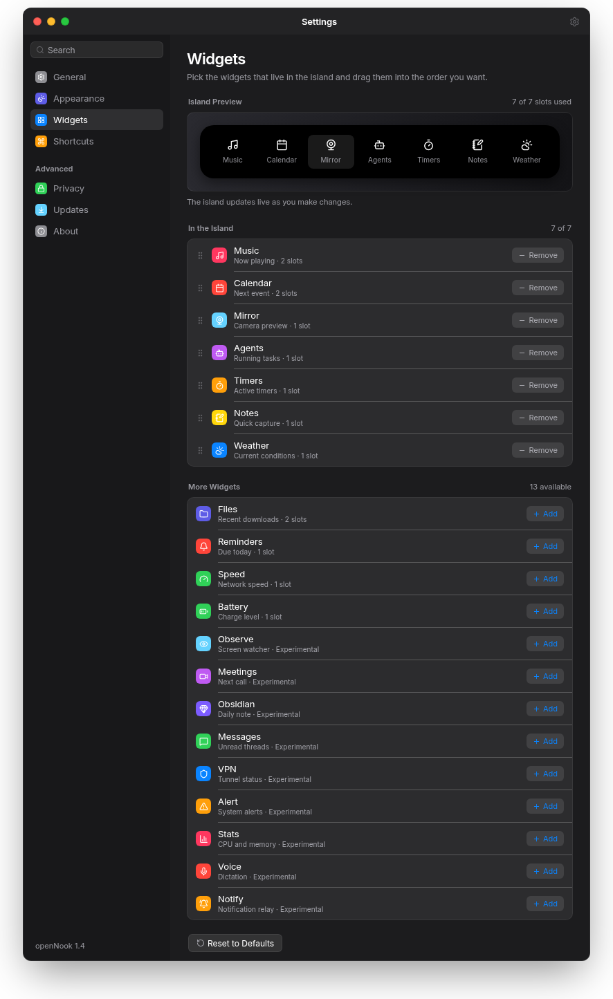

# openNook

**A Dynamic Island that actually lives on the desktop.** A native macOS and
Linux overlay, GPU-rendered with [GPUI](https://www.gpui.rs), that hangs from
the notch (or the top of the screen) and surfaces Now Playing, calendar,
reminders, timers, weather, battery, a file tray, and live coding-agent status
without taking a Dock slot.

[](LICENSE)
[](https://github.com/prodBirdy/openNook/releases)
[](Cargo.toml)

It stays out of the way until you glance at it. Hover or click the housing and
it expands; Esc collapses it. Same Rust client on both platforms — macOS gets
the camera-housing wrap, MediaRemote, EventKit, Liquid Glass and AirDrop;
Linux uses desktop-friendly fallbacks and a Vulkan path.

```
$ ./scripts/with-metal.sh cargo run -p nook

nook
  compact  →  camera housing + 1px wrap
  expand   →  hover / click
  settings →  ⌘,
  quit     →  ⌘Q
```

| widget | what it shows | notes |
| --- | --- | --- |
| Agents | live coding-agent status | busy vs idle from the session, not CPU noise |
| Media | Now Playing, controls, album art | MediaRemote on macOS |
| Calendar | upcoming events | EventKit; prompted only when enabled |
| Reminders | due items | same |
| Timers | countdown | |
| Weather | current conditions | location optional; city entry works instead |
| Battery | charge | |
| Files | tray for open / move | AirDrop and LocalSend on macOS |
| Notes | scratch notes | |
| Speed | network speed test | |
| Mirror | camera preview | macOS only |
| Terminal | real login shell | opt-in, off by default |

Experimental widgets sit behind a Settings toggle.

Product preview (design mock):




## Install

Published builds are on [GitHub Releases](https://github.com/prodBirdy/openNook/releases).

or clone and build. macOS needs the Metal wrapper so Calendar, Reminders,
Camera, Location and Automation prompts work as an app bundle:

```
./scripts/with-metal.sh cargo run -p nook
```

```
./scripts/with-metal.sh ./scripts/bundle.sh
open target/OpenNook.app
```

Linux uses the same `nook` crate after the packages in `scripts/linux-deps.sh`.
It needs a Vulkan driver.

```
./scripts/with-metal.sh cargo run -p nook     # macOS
cargo run -p nook                             # Linux, after linux-deps.sh
```

## Keyboard

Hover or click the notch to expand.

```
Esc     collapse
⌘,      Settings
⌘Q      quit
```

## Permissions

Nothing is requested until the matching widget is on.

| permission | when |
| --- | --- |
| Calendar / Reminders | those widgets enabled |
| Camera | Mirror enabled |
| Location | Weather uses your location |
| Automation | media-control fallback |
| Microphone / Speech Recognition | experimental Voice recorder |
| Accessibility | media-key and HUD interception |
| Full Disk Access | experimental Messages / Notifications |
| Local Network | LocalSend enabled |

## Platform notes

| capability | macOS | Linux |
| --- | --- | --- |
| camera-housing notch wrap | yes | no; top-center compact |
| MediaRemote | yes | no |
| EventKit | yes | no |
| Liquid Glass | yes | no |
| Camera Mirror | yes | no |
| AirDrop / AppKit drag-out | yes | no; LocalSend / tray still work |
| Settings + file tray | yes | yes |
| GPU | Metal | Vulkan |

## Contributing

See [CONTRIBUTING.md](CONTRIBUTING.md) for the build, test, crate layout, and
design rules.

## License

MIT. See [LICENSE](LICENSE).
