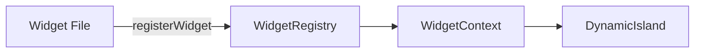

# Plugin API Reference

This document provides a comprehensive reference for the openNook widget/plugin API.

## Overview

Widgets register themselves via `registerWidget()` and the system handles rendering, state persistence, and lifecycle management.



## WidgetManifest Interface

Every widget must provide a manifest with these properties:

```typescript
interface WidgetManifest {
  // Required
  id: string;                      // Unique identifier (e.g., 'timer', 'calendar')
  name: string;                    // Display name in settings
  description: string;             // Short description
  icon: ComponentType;             // Icon from @tabler/icons-react
  ExpandedComponent: ComponentType; // Main widget component
  defaultEnabled: boolean;         // Whether enabled by default
  category: 'productivity' | 'media' | 'utility';
  hasCompactMode: boolean;         // Has compact mode?

  // Optional
  CompactComponent?: ComponentType<CompactWidgetProps>; // Compact view
  minWidth?: number;               // Min width in pixels (default: 300)
  compactPriority?: number;        // Lower = higher priority in compact bar
}
```

## Registration

Import `registerWidget` and call it at module scope:

```typescript
import { registerWidget } from './WidgetRegistry';
import { IconClock } from '@tabler/icons-react';

// Define your components
function MyWidget() { /* ... */ }
function MyCompactWidget(props: CompactWidgetProps) { /* ... */ }

// Register at module execution
registerWidget({
  id: 'my-widget',
  name: 'My Widget',
  description: 'Does something useful',
  icon: IconClock,
  ExpandedComponent: MyWidget,
  CompactComponent: MyCompactWidget,
  defaultEnabled: false,
  category: 'utility',
  hasCompactMode: true,
  compactPriority: 50
});
```

## Available Hooks

### useWidgets

Access widget state and operations:

```typescript
import { useWidgets } from '../context/WidgetContext';

function MyComponent() {
  const {
    widgets,            // All registered widgets
    enabledWidgets,     // Currently enabled widgets
    toggleWidget,       // Toggle widget on/off
    setWidgetEnabled,   // Set enabled state
    instances,          // Widget instances
    addInstance,        // Create new instance
    removeInstance,     // Delete instance
  } = useWidgets();
}
```

### useNotification

Show notifications:

```typescript
import { useNotification } from '../context/NotificationContext';

function MyWidget() {
  const { showNotification } = useNotification();

  const handleSave = () => {
    showNotification('Saved successfully!', 'success');
  };
}
```

## UI Components

### WidgetWrapper

Provides consistent styling for expanded widgets:

```typescript
import { WidgetWrapper } from './WidgetWrapper';

function MyWidget() {
  return (
    <WidgetWrapper
      title="My Widget"
      headerActions={[<button key="add">+</button>]}
    >
      {/* Widget content */}
    </WidgetWrapper>
  );
}
```

### WidgetAddDialog

Standard dialog for adding items:

```typescript
import { WidgetAddDialog } from './WidgetAddDialog';
import { z } from 'zod';

const schema = z.object({
  name: z.string().min(1),
  duration: z.coerce.number().min(1),
});

function MyWidget() {
  const [showDialog, setShowDialog] = useState(false);

  return (
    <WidgetAddDialog
      open={showDialog}
      onOpenChange={setShowDialog}
      title="Add Item"
      schema={schema}
      defaultValues={{ name: '', duration: 5 }}
      onSubmit={(data) => console.log(data)}
      fields={[
        { name: 'name', label: 'Name', required: true },
        { name: 'duration', label: 'Duration', type: 'number' }
      ]}
    />
  );
}
```

## CompactWidgetProps

Props passed to compact widgets:

```typescript
interface CompactWidgetProps {
  baseNotchWidth: number;  // Width of the notch
  isHovered: boolean;      // Whether DynamicIsland is hovered
  contentOpacity: number;  // Opacity for content (0-1)
}
```

## Tauri Backend Commands

Widgets can call Rust commands via `invoke`:

```typescript
import { invoke } from '@tauri-apps/api/core';

// Example: Save custom data
await invoke('db_execute', {
  sql: 'INSERT INTO my_table (data) VALUES (?)',
  params: [myData]
});

// Example: Load data
const rows = await invoke<MyType[]>('db_select', {
  sql: 'SELECT * FROM my_table'
});
```

## Best Practices

1. **Unique IDs**: Use kebab-case, descriptive IDs
2. **Icons**: Use `@tabler/icons-react` for consistency
3. **Compact Mode**: Implement if widget has ongoing state (timer, media)
4. **Error Handling**: Always wrap `invoke` calls in try/catch
5. **Persistence**: Use `db_execute`/`db_select` for data, context for UI state
